## Mesh (final submission)

Please fill this out and submit your work to Gradescope by the deadline.

### Output Comparison
Run the program with the specified `.ini` config file to compare your output against the reference images. The program should automatically save the output mesh to the `student_outputs/final` folder. Please take a screenshot of the output mesh and place the image in the table below. Do so by placing the screenshot `.png` in the `student_outputs/final` folder and inserting the path in the table.

- For instance, after running the program with the `subdivide_icosahedron_4.ini` config file, go to and open `student_outputs/final/subdivide_icosahedron_4.obj`. Take a screenshot of the mesh and place the screenshot in the first row of the first table in the column titled `Your Output`.
- The markdown for the row should look something like `| subdivide_icosahedron_4.ini |   |  |`

If you are not using the Qt framework, you may also produce your outputs otherwise so long as the output images show up in the table. In this case, please also describe how your code can be run to reproduce your outputs.

> Qt Creator users: If your program can't find certain files or you aren't seeing your output images appear, make sure to: 
> 1. Set your working directory to the project directory
> 2. Set the command-line argument in Qt Creator to `template_inis/final/<ini_file_name>.ini`

Note that your outputs do **not** need to exactly match the reference outputs. There are several factors that may result in minor differences, especially for certain methods like simplification where equal-cost edges may be handled differently.

Please do not attempt to duplicate the given reference images; we have tools to detect this.

| `.ini` File To Produce Output | Expected Output | Your Output |
| :---------------------------------------: | :--------------------------------------------------: | :-------------------------------------------------: | 
| subdivide_icosahedron_4.ini |  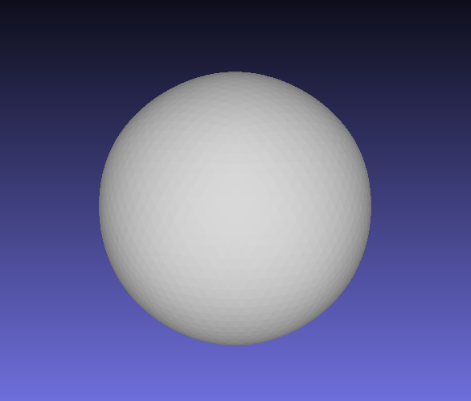 | 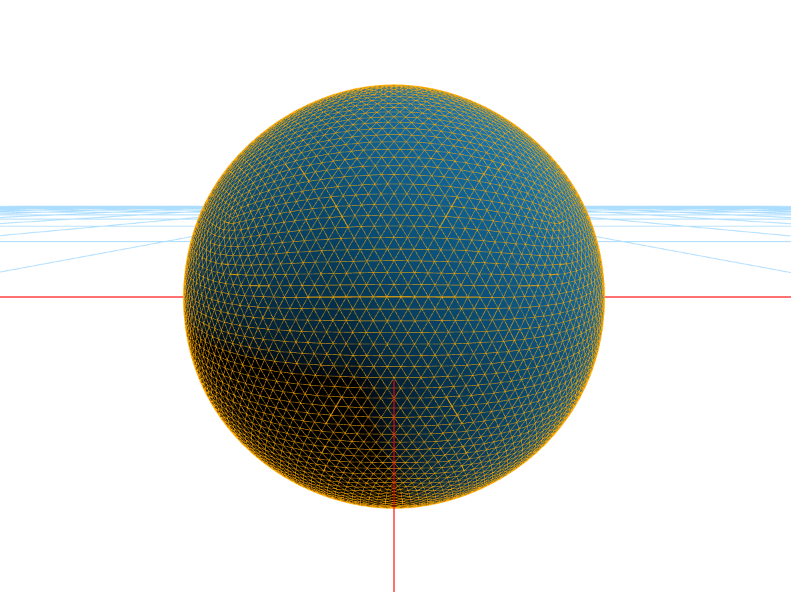 |
| simplify_sphere_full.ini |   | 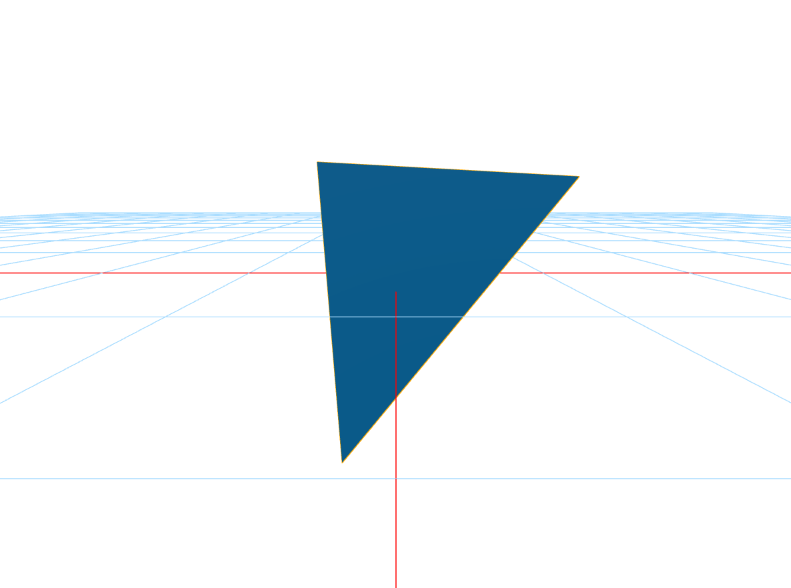 |
| simplify_cow.ini | 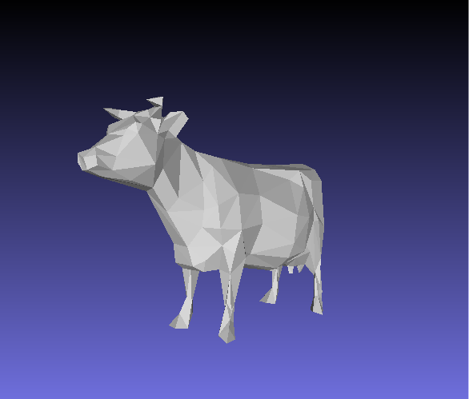 | 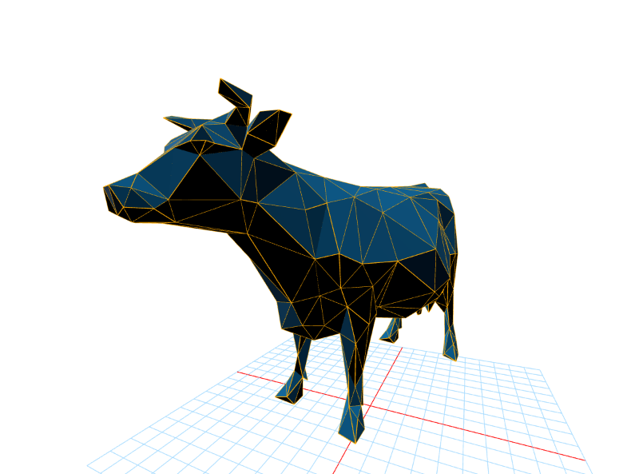 |

Output for Isotropic Remeshing (Note: if you did not implement this you can just skip this part)
| `.ini` File To Produce Output | Input Mesh .png | Remeshed Mesh .png |
| :---------------------------------------: | :--------------------------------------------------: | :-------------------------------------------------: | 
| /template_inis /final / remesh_cow_fine.ini | 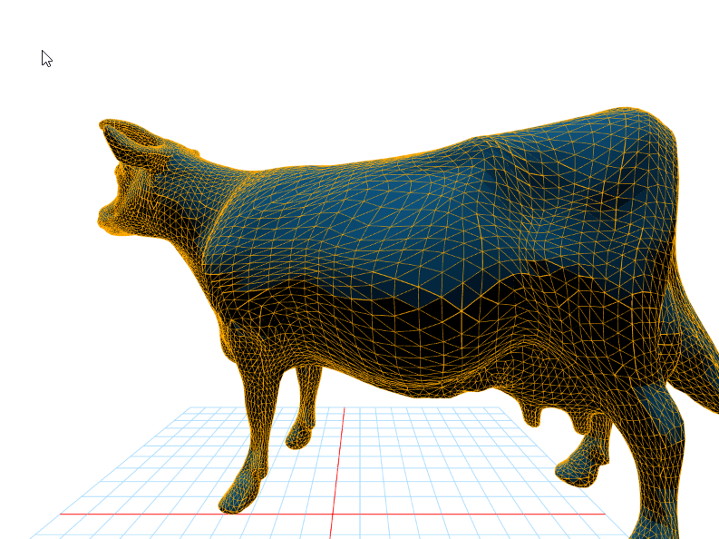 | 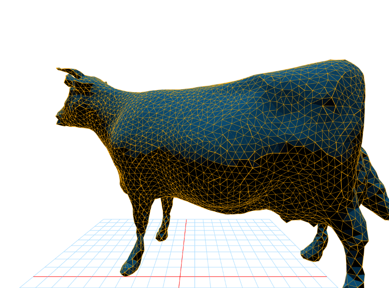 |
| /template_inis /final / remesh_peter.ini | 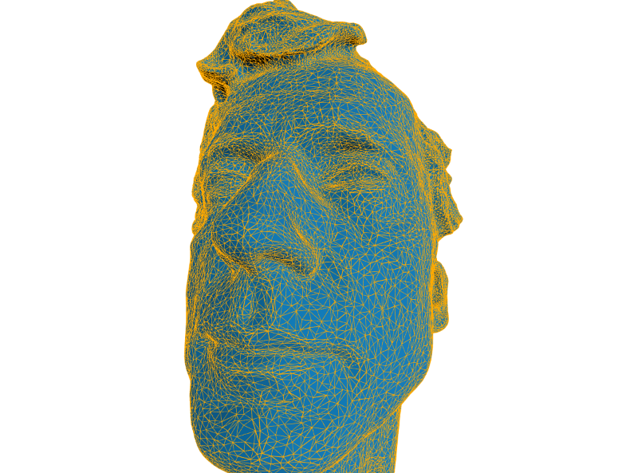 | 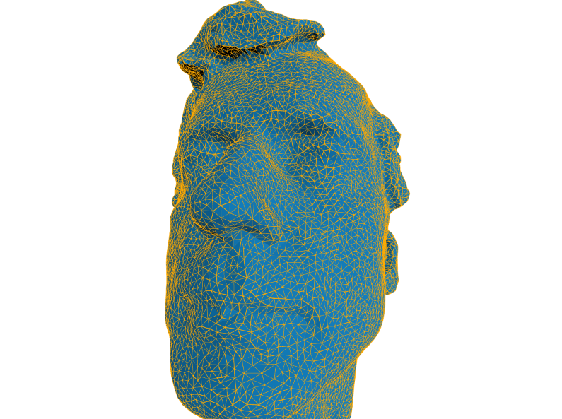 |

Output for Bilateral Mesh Denoising (Note: if you did not implement this you can just skip this part)
| `.ini` File To Produce Output | Noisy Mesh .png | Denoised Mesh .png |
| :---------------------------------------: | :--------------------------------------------------: | :-------------------------------------------------: | 
| /template_inis /final /filter_cow_noisy.ini | 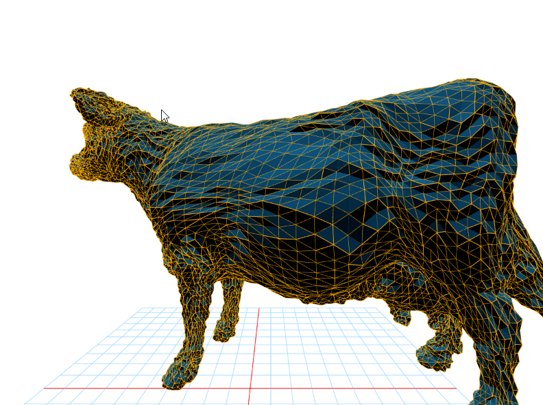 | 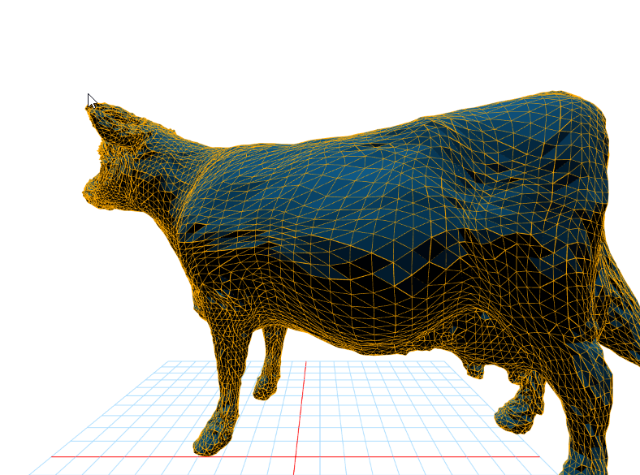 |
| /template_inis /final /filter_peter_noisy.ini | 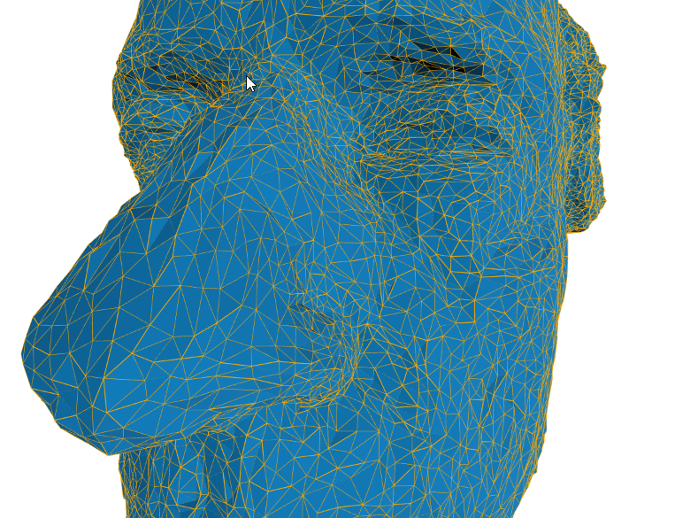 | 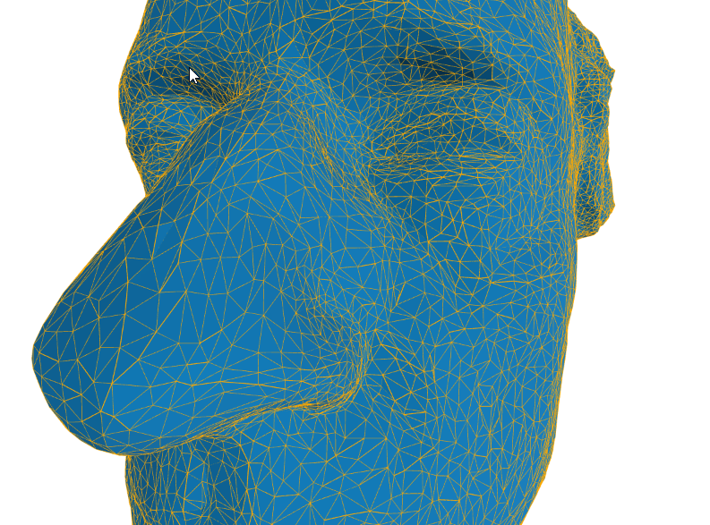 |

Output for any other Geometry Processing Functions (Note: if you did not implement this you can just skip this part)
| `.ini` File To Produce Output | Input | Output |
| :---------------------------------------: | :--------------------------------------------------: | :-------------------------------------------------: | 
| <Path to your .ini file> |   |  |

### Design Choices

#### Mesh Data Structure 
Describe your mesh data structure here. 

My mesh data structure is based on the halfedge data structure where we store halfedges with next and twin pointers to connect everything. My three major structures were `Halfedge`, `Vertex`, and `Face`. I ended up not using a plain `Edge` structure because a halfedge `he` and its twin `he.twin` essentially give us a full edge. 

I stored boolean flags in my halfedge and vertex structures to assist efficient recursive traversal of the mesh (i.e. don't double visit). I also stored a cache in my data structures which can store relevant information like the associated cost or `Q` quadric error with some primitive. 

#### Mesh Validator
Describe what your mesh validator checks for here. This can be a list.

I implemented the halfedge datastructure to store my meshes. My mesh validator function checks for:
1) Every halfedge has a twin, and the twin's twin is the halfedge itself.

2) Every halfedge has a pointer to the vertex it is leaving.
3) Every vertex is attached to a valid halfedge.
4) Every halfedge has a pointer to the face it belongs to.
5) Every face has a pointer to the halfedge it belongs to.

6) Every triangle has three halfedges that point into each other (where you can get back to the start).
7) Double check that we have the right number of halfedges (h) to faces (f) where 3*h must equal f (because each face has its own three halfedges).
8) For every pair of triangles joined by two halfedges, we can walk around the "border" of these two triangles with next and twin pointers to check they are set right.
9) When we delete vertices, make sure they are completely deleted with no pointers pointing to them anymore (i.e. vertices without something referencing are not allowed). 
10) When we delete faces, make sure they are completely deleted with no pointers pointing to them anymore (i.e. every face must have three halfedges pointing to it). 

11) Double check that all the flags the vertex/halfedge data structures contain (which assist traversal / algorithms) are reset so that different mesh operations do not get messed up by ill-set flags.

#### Run Time/Efficency 
Describe how you achieved efficient asymptotic running times for your geometry processing functions, including the data structures you used.

For my subdivision operation, I was able to achieve symptotic running time via the halfedge data structure. For every edge, I am able to get the neighboring edges/vertices through a fixed number of `next` and `twin` calls and create the new halfedges/modify existing pointers. So my final implementation for a mesh with $n$ edges is $O(n)$.

For my simplify operation, I was again able to achieve asymptotic running time using the halfedge data structure. For every edge to remove, I get the neighboring edges/vertices through a fixed number of `next` and `twin` calls (only varying on the vertex degree, typically between 3-7). So my final implementation for removing $n$ edges is $O(n)$.

For remeshing, all my edge split, flip, and collapse operations are constant time because of the halfedge data structure. Given any edge, the operation can occur without any additional searching since everything is locally connected with the halfedge paradigm. So my edge split, flip, collapse, and re-center stages (which potentially&mdash;but doesn't actually&mdash;apply to all $n$ edges in the mesh) all take $O(n)$ each and $O(4n)\rightarrow O(n)$ again.

Similarly for bilateral denoising, my halfedge data structure makes the operation $O(n)$. Notably, getting the neighborhood of vertices is constant time (only varying on the degree of a vertex, typically between 3-7 so we can consider it constant) with halfedge next/twin calls.

### Collaboration/References

I referenced the three papers linked in the README.md. 

I also used the `@datastructures-js/priority-queue` library for the priority queue required by mesh simplification, rather than writing my own. 

### Known Bugs

Mesh simplification sometimes gives shapes that "don't look quite right" (i.e. fully simplifying the sphere doesn't give a near-perfect tetrahedron as one may expect).

My mesh filtering is also finnicky with the $\sigma_c$ and $\sigma_s$ terms. While it works once the sigma terms for the Gaussians are tuned correctly, it seems like the band of "good" sigmas is too narrow. I suspect this is due to using Euclidean distance and not geodesic distance.